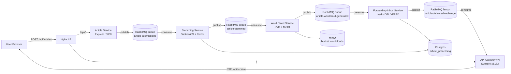
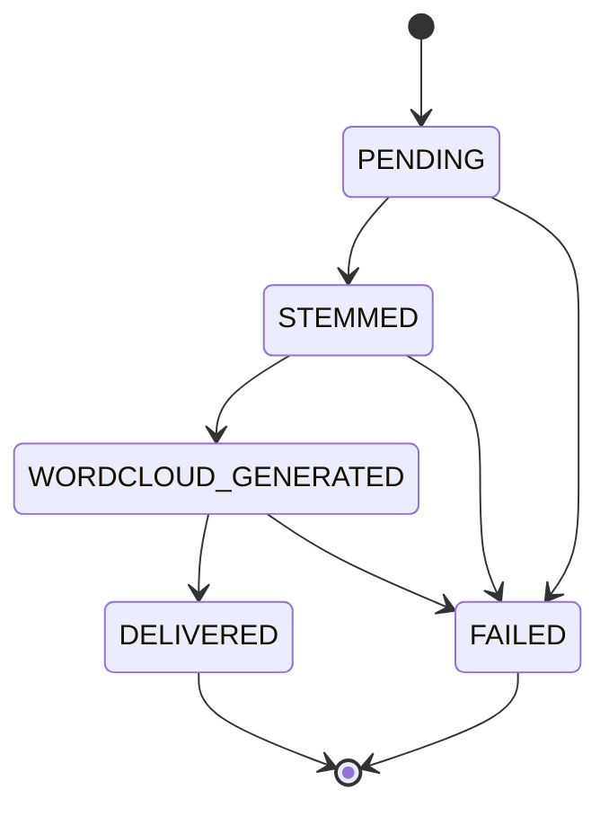
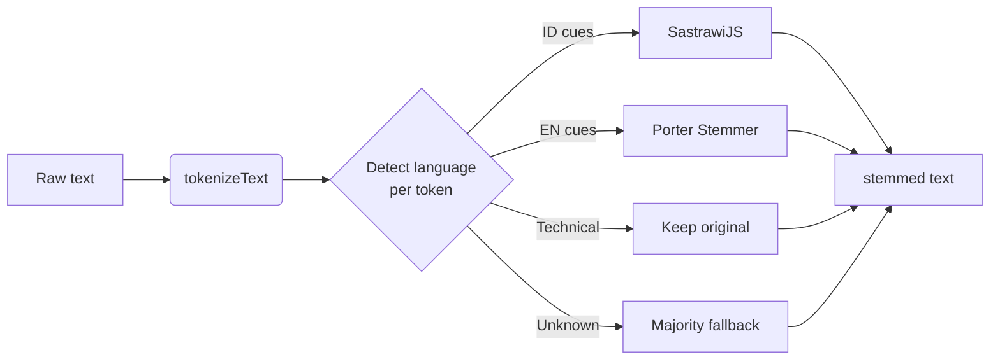
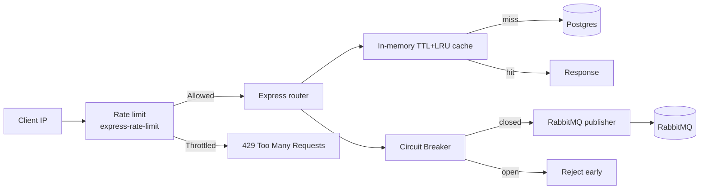
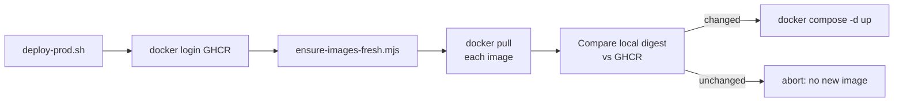
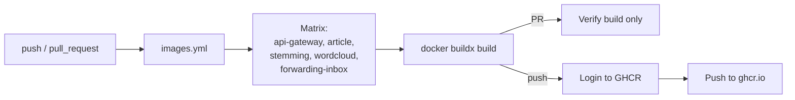

# ArticleSwap

Distributed event-driven article exchange platform built with **SvelteKit**, **Node.js microservices**, **RabbitMQ**, **PostgreSQL**, **MinIO**, and **Nginx**. Submitted articles flow through an asynchronous pipeline that stems text, generates a word cloud, and pushes the result to the recipient in real time.

## High-Level Architecture



### Article status state machine



## Repository Layout

| Path | Role | Notes |
|---|---|---|
| `api-gateway/` | SvelteKit UI + SSE + RabbitMQ fanout consumer | Port 5173, scaled to 2 instances behind Nginx |
| `services/article-service/` | Express HTTP entry + RabbitMQ publisher | Port 3000 |
| `services/stemming-service/` | Mixed ID/EN per-token stemmer | SastrawiJS + natural Porter |
| `services/wordcloud-service/` | SVG word cloud generator + MinIO upload | |
| `services/forwarding-inbox-service/` | Final delivery + DB write | |
| `nginx/` | LB config | `proxy_buffering off` for SSE |
| `docker-compose.yml` | Full stack orchestration | RabbitMQ, Postgres, Redis, MinIO |
| `.github/workflows/` | CI/CD pipelines | See *CI / CD* below |

## Services Overview

| Service | Owner (per project brief) | Inputs | Outputs | Tests |
|---|---|---|---|---|
| API Gateway + Article Service | Anggota 1 | `POST /api/articles` (text or PDF) | RabbitMQ `article-submissions`, SSE to receiver | svelte-check, manual |
| Stemming Service | Anggota 2 | RabbitMQ `article-submissions` | DB row, RabbitMQ `article-stemmed` | `node --test` |
| Word Cloud Service | Anggota 3 | RabbitMQ `article-stemmed` | MinIO object, RabbitMQ `article-wordcloud-generated` | manual |
| Forwarding + Inbox Service | Anggota 4 | RabbitMQ `article-wordcloud-generated` | DB row, RabbitMQ fanout `article-delivered.exchange` | manual |
| Infrastructure | Anggota 5 | – | RabbitMQ, Postgres, Redis, MinIO, Nginx | manual |

## Stemming (mixed ID/EN)

`services/stemming-service/src/usecases/StemArticle.js` exposes:

- `tokenizeText(text)` — keeps punctuation, URLs, emails, code-like chunks.
- `detectTokenLanguage(token)` — per-token score using ID/EN stopword lists, common-word sets, and affix patterns (`me-`, `ber-`, `ter-`, `pe-`, `-kan`, `-nya`, `-lah`, `-ing`, `-ed`, `-ly`, `-tion`, `-s`).
- `stemToken(token, fallback)` — runs SastrawiJS for ID, natural Porter for EN, preserves technical terms (`rabbitmq`, `redis`, `docker`, `postgres`, `scalable`, `storage`, `recycle`, …).
- `stemMixedLanguageText(text)` — tokenizes, detects majority language, stems per token.



Example:

```text
"Pengembangan aplikasi scalable sangat menyenangkan karena users can share articles quickly."
→ "kembang aplikasi scalable sangat senang karena user can share article quick."
```

Run unit tests:

```bash
cd services/stemming-service
npm test
```

## Performance & Safety Add-Ons



- **IP rate limit on `POST /api/articles`** via `express-rate-limit` (`RATE_LIMIT_WINDOW_MS`, `RATE_LIMIT_MAX_REQUESTS`).
- **`TRUST_PROXY`** opt-in for `X-Forwarded-For` behind Nginx.
- **In-memory TTL cache** (LRU) for `GET /api/articles` and `GET /api/articles/:id`; POST invalidates only `list:*` keys.
- **Circuit breaker** around `RabbitMQEventPublisher.publish` (cooldown + failure threshold) in `article-service`.
- **Parallel startup** — topic ensure + producer connect run via `Promise.all`; worker topic ensure pairs parallelized.
- **Mixed-language stemming** preserves readability (URLs, emails, code, technical terms).

## Running Locally

### Docker (recommended)

```bash
docker compose up --build
```

Access:

| URL | What |
|---|---|
| http://localhost:8080 | Dashboard (load-balanced) |
| http://localhost:15672 | RabbitMQ Management UI (`articleswap` / `articleswap`) |
| http://localhost:9001 | MinIO console (`articleswap` / `articleswap123`) |
| `localhost:5432` | Postgres |
| `localhost:6379` | Redis |

Stop and clean:

```bash
docker compose down        # stop containers
docker compose down -v     # drop volumes (RabbitMQ state, Postgres, MinIO)
```

### Native (no Docker)

```bash
./run.sh          # starts 2 gateway instances + Nginx
```

Or manually in separate terminals:

```bash
cd api-gateway && npm run dev -- --port 5173
cd api-gateway && npm run dev -- --port 5174
nginx -p <path> -c <path>/nginx.conf
```

## Environment Variables

Each service ships its own `.env.example`:

- `api-gateway/.env.example`
- `services/article-service/.env.example`
- `services/stemming-service/.env.example`
- `services/wordcloud-service/.env.example`
- `services/forwarding-inbox-service/.env.example`

## API Endpoints

### `POST /api/articles`

Accepts text or PDF payloads.

```json
{
  "title": "Judul Artikel",
  "content": "Isi artikel...",
  "sender": "alice",
  "receiver": "bob"
}
```

For PDF: include `fileData` (base64) and `fileName` ending in `.pdf`. Returns `202 Accepted` with `{ articleId, status: "PENDING" }`.

### `GET /api/articles`

List articles with `limit`, `offset`, `sender`, `receiver`, `status` filters.

### `GET /api/articles/:id`

Fetch one article; includes `stemmed_content`, `wordcloud_url`, and delivery info.

### `GET /api/receive?receiver=<username>`

SSE stream of newly delivered articles.

### `GET /health`

Liveness probe.

## Production Deploy (pull from GHCR)

Use `docker-compose.prod.yml` + `scripts/deploy-prod.sh`.



One-time setup:

```bash
cp .env.prod.example .env.prod
# adjust IMAGE_NAMESPACE, IMAGE_TAG, secrets
export GHCR_USER=feinru GHCR_TOKEN=<ghcr PAT or github token>
```

Deploy:

```bash
./scripts/deploy-prod.sh
# or pin a specific commit
IMAGE_TAG=sha-1fe398b ./scripts/deploy-prod.sh
```

The freshness check pulls every image, compares the local `RepoDigests` against GHCR, and only calls `docker compose up -d` when at least one image actually moved. If nothing changed it exits `2` and skips the restart.

`docker-compose.prod.yml` defines `image:` per service from `IMAGE_*` env vars, with `pull_policy: always`. Override at deploy time:

```bash
IMAGE_TAG=sha-1fe398b docker compose -f docker-compose.prod.yml --env-file .env.prod up -d
```

## CI / CD (GitHub Actions + GHCR)



`.github/workflows/images.yml` builds every Dockerfile on push/PR to `main`, tags images with the commit SHA, branch name, and `latest`, then pushes to `ghcr.io/<owner>/articleswap-<service>`. Each service image is independently pullable:

```bash
docker pull ghcr.io/<owner>/articleswap-api-gateway:latest
docker pull ghcr.io/<owner>/articleswap-article-service:latest
docker pull ghcr.io/<owner>/articleswap-stemming-service:latest
docker pull ghcr.io/<owner>/articleswap-wordcloud-service:latest
docker pull ghcr.io/<owner>/articleswap-forwarding-inbox-service:latest
docker pull ghcr.io/<owner>/articleswap-nginx:latest
```

Required secret: `GITHUB_TOKEN` (provided automatically). The workflow uses it to authenticate to GHCR.

## Pitfalls & Notes

- **SSE behind Nginx** requires `proxy_buffering off` and a long `proxy_read_timeout` (already set in `nginx/nginx.conf`).
- **SvelteKit in container** runs Vite dev with bind-mounted source for HMR. For production, install `@sveltejs/adapter-node` and run `node build/index.js`.
- **Mixed-language stemming** is heuristic; tokens with neither ID nor EN cues fall back to a majority-language pass (default `id`).
- **Rate limit on POST** is per-IP. Set `TRUST_PROXY` to the number of trusted proxies (typically `1` behind Nginx).
- **First publish** to a new RabbitMQ queue can race; `RabbitMQQueueEnsurer.ensure()` runs at startup.
